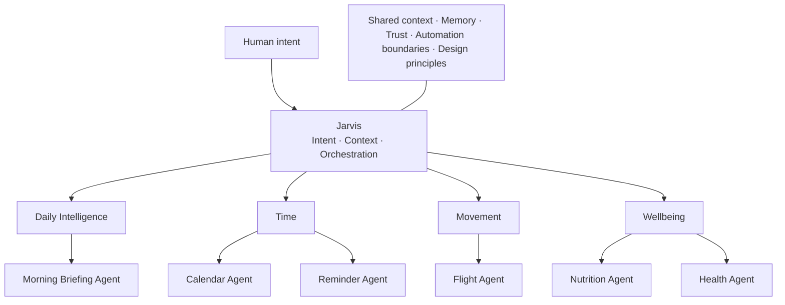

# Portfolio Design Foundation

## Status

This design foundation is **canonical and locked**.

The portfolio is not a gallery of independent projects. It is a guided tour through one evolving body of work: intelligent systems that remove friction from everyday life.

Jarvis is the orchestrator, AI-Lab is the workshop, and each agent is a specialized capability within the same long-term pursuit.

## North Star

> Everyday life, thoughtfully automated.

John Moses builds connected systems for time, travel, health, and the small decisions that shape a day.

The portfolio should communicate:

> This person does not just write code. He builds systems.

The emotional memory to leave with visitors is:

> John notices the invisible friction in everyday life—and cares enough to build calm, thoughtful systems that make it disappear.

## Canonical Decisions

### Product position

**Make the ecosystem the portfolio.**

- Promise: Everyday life, thoughtfully automated.
- Proof: Connected systems, not isolated demos.
- Personality: Precision with warmth.

### Creative direction

**The Luminous Workshop**

> A quiet room. A precise instrument. Evidence of a curious person at work.

The future is present, but it has been made calm enough to examine.

The visual identity combines:

- 70% Quiet Intelligence: layout, type, pacing, hierarchy, and restraint.
- 20% Human Systems Journal: voice, annotations, warmth, artifacts, and pixel lineage.
- 10% Systems Observatory: the signature ecosystem map and orchestration sequence only.

### Canonical visual metaphor

**The Long Table**

> It feels like walking beside one uninterrupted workbench where a decade of intelligent systems is being assembled in plain sight.

The Long Table is translated digitally through alignment, accumulation, material contrast, and spatial progression—not through a literal table photograph or a 3D environment.

- Table becomes a persistent horizontal datum.
- Walking becomes vertical narrative progression.
- Objects become evidence with provenance.
- Instrument becomes the active ecosystem plane.
- Accumulation becomes visible iteration and history.

### Homepage narrative

```text
Arrival
  ↓
Discovery
  ↓
Understanding
  ↓
Evidence
  ↓
Judgment
  ↓
Person
  ↓
Invitation
```

Every chapter is necessary:

- No arrival means no thesis.
- No discovery means no ecosystem.
- No understanding means no orchestration.
- No evidence means no proof.
- No judgment means no seniority.
- No person means no warmth.
- No invitation means no continuation.

## Canonical System Model



Jarvis is not a project card, mascot, chatbot, or global navigation control. Jarvis is the coordinating layer that interprets intent, carries context, and makes the relationships between specialized capabilities legible.

## Source Documents

Read the foundation in this order:

1. [Product Blueprint](./01-product-blueprint.md)
2. [Information Architecture](./02-information-architecture.md)
3. [Creative Direction](./03-creative-direction.md)
4. [Visual World Exploration](./04-visual-world-exploration.md)
5. [Homepage Specification](./05-homepage-specification.md)
6. [Design Principles](./06-design-principles.md)
7. [Open Questions](./07-open-questions.md)

See [README](./README.md) for the purpose of each document.

## Final Decision Filter

> Does this make the system clearer, the judgment more credible, or the person more memorable?

If the answer is no, remove it—even if the effect is technically impressive.
