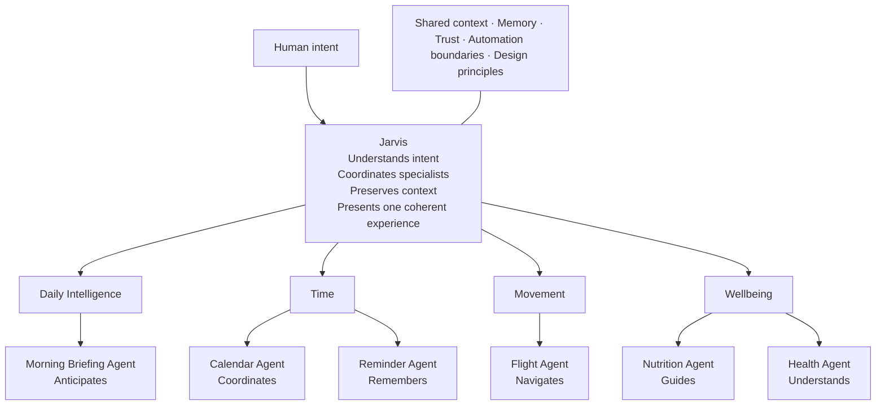

# Information Architecture

## Organize by Role in the System, Then by Human Outcome

Do not present eight equal “projects.” That framing makes the work look smaller and more fragmented than it is.

The primary object is AI-Lab. Jarvis is its coordinating interface. The agents are capabilities grouped around needs.

## AI-Lab Ecosystem



### Orchestration Layer

**Jarvis**

Understands intent · coordinates specialists · preserves context · presents one coherent experience

### Capabilities

| Capability | Role | Purpose |
|---|---|---|
| Morning Briefing | Anticipates | Turns context into a useful start to the day. |
| Flight Agent | Navigates | Reduces uncertainty around movement and travel. |
| Calendar Agent | Coordinates | Protects time and resolves scheduling friction. |
| Reminder Agent | Remembers | Closes loops before they become cognitive load. |
| Nutrition Agent | Guides | Makes everyday food decisions more informed. |
| Health Agent | Understands | Finds useful patterns across personal wellbeing. |

Shared context, memory, trust, automation boundaries, and design principles live beneath every capability.

## Homepage Sequence

1. **Threshold.** A decisive thesis, one-line identity, and an ecosystem glimpse. No biography dump.
2. **The system.** An explorable map showing Jarvis coordinating specialized agents inside AI-Lab.
3. **A day with the system.** One guided scenario demonstrates collaboration better than six isolated cards.
4. **Jarvis.** The flagship case study: intent, orchestration, decisions, evolution, and limits.
5. **Selected systems.** Three to four deeper stories organized by human need, not technology.
6. **Lab notes.** Architecture decisions, experiments, failures, and product thinking in compact form.
7. **The builder.** A concise human portrait: Microsoft, principles, interests, and the life motivating the work.
8. **Open channel.** A restrained invitation to discuss systems, products, research, or ambitious ideas.

The shipping homepage sequence refines this architecture into seven narrative phases. See [Homepage Specification](./05-homepage-specification.md).

## Project Hierarchy

### A. Flagship system

Jarvis receives the richest story and demonstrates orchestration across the whole ecosystem.

### B. Capability stories

Group agents under Time, Movement, Wellbeing, and Daily Intelligence. Feature only the strongest three or four.

### C. Experiments

Smaller tools belong in a compact lab index with honest status, a sharp premise, and one learning.

### D. Foundations

Architecture, memory, evaluation, privacy, and automation principles appear as reusable system layers—not separate portfolio projects.

## Case-Study Anatomy

1. **Human friction.** What recurring problem was worth removing?
2. **System behavior.** What does the experience do from the user’s point of view?
3. **Judgment.** Which constraints, risks, and trade-offs shaped it?
4. **Architecture.** How do data, intelligence, interfaces, and automation cooperate?
5. **Evidence.** What works, what changed, and what can be demonstrated honestly?
6. **Next frontier.** How does this capability strengthen the larger ecosystem?

## Jarvis Positioning

### Jarvis should be central, not oversized.

Jarvis becomes important through relationships: other agents route through it, scenarios begin with it, and every case study returns to the shared system.

Avoid:

- A giant Jarvis logo.
- A product-pricing narrative.
- Repeated “assistant” claims.
- A face, glowing orb, voice waveform, or superhero mythology.
- A floating assistant, conversational overlay, mascot, or replacement for clear navigation.

The system map does the positioning work.

## Outcome-Based Entry Points

Visitors choose a human intention rather than selecting an agent:

- Start my day.
- Plan travel.
- Protect my time.
- Understand my health.

Only relationships relevant to the chosen intention gain emphasis. Unrelated systems recede but remain spatially present.

## Capability States

Use precise, humane states:

- In daily use.
- On the bench.
- Under test.
- Retired with lessons.

Do not invent live telemetry. Show the latest meaningful change instead.

## Evidence Architecture

Artifacts are assembled, not carded. Each story begins with one primary piece of real work. Supporting evidence sits in a deliberate relationship around it.

### Evidence types

| Type | Question | Form |
|---|---|---|
| Output | What did the system produce? | Screenshot, briefing, recommendation, reminder, itinerary, or report. |
| Decision | Why does it behave this way? | A consequential choice with context, alternatives, and outcome. |
| Tradeoff | What was protected? | Speed versus trust, automation versus confirmation, breadth versus reliability. |
| Change | How did the work evolve? | A dated revision, deployment note, or meaningful commit explained in human terms. |
| Failure | What did not survive? | A rejected experiment and the evidence that ended it. |
| Boundary | Where does the system stop? | Privacy, uncertainty, maintenance, or a decision deliberately left to a person. |

### Three-depth lens

Each artifact can be read at three depths:

1. Experience
2. Decisions
3. Architecture

The artifact remains in position while its annotation layer changes.

## Navigation Model

Navigation behaves like a datum rail, not a themed control panel.

```text
JOHN MOSES                    SYSTEM    EVIDENCE    NOTES    CONTACT
──────────────────────────────────────────────────────────────────
```

### Primary destinations

- **System:** Returns to the AI-Lab ecosystem and authored scenarios.
- **Evidence:** Moves to the first artifact assembly, not a project listing.
- **Notes:** Opens lab notes, decisions, experiments, and field observations.
- **Contact:** Moves to the Far End and its direct invitation.

### Secondary orientation

- **Workbench index:** A compact index lists capabilities, artifacts, notes, and states for visitors who prefer direct lookup.
- **Current context:** Inside the instrument, a small label states the active intention and participating systems.
- **Return path:** Every deep artifact links back to its role in the ecosystem.
- **Professional references:** GitHub, LinkedIn, and résumé remain compact at the Far End.

### Usability boundary

The Long Table metaphor governs composition and storytelling. It does not rename familiar actions, conceal destinations, require horizontal travel, or make visitors manipulate objects to access essential content.

## Related Documents

- [Product Blueprint](./01-product-blueprint.md)
- [Homepage Specification](./05-homepage-specification.md)
- [Design Principles](./06-design-principles.md)
